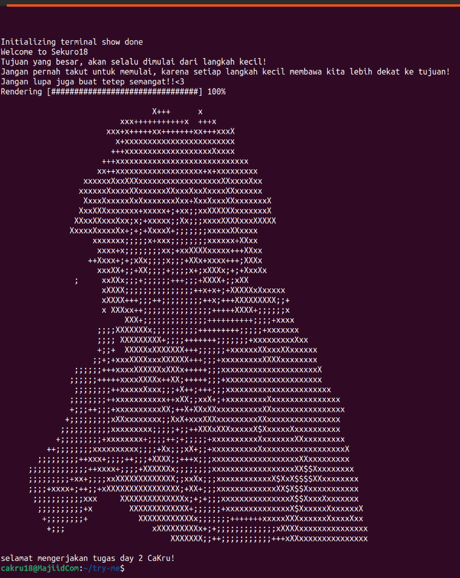

# Intruksi Penilaian

1. add-user-ssh-1 : harus menampilkan output yang sesui dengan foto pada saat menjalankan 
```
sudo bash adduser.sh
```
lalu pada gambar harus menampilkan bahwa cakru berhasil masuk ke user cakru18 dengan ssh

2. execute-user-ssh-1 : harus sesuai gambar pada file ini ya
